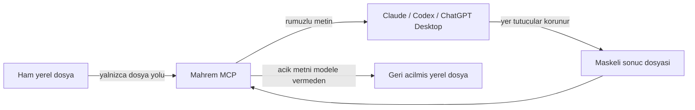

# Mahrem

**Hassas veriyi yapay zekâya gitmeden önce cihazda rumuzlayan açık kaynak gizlilik katmanı.**

Mahrem ayrı bir SaaS veya belge yükleme sitesi değildir. Yerel MCP aracı + skill paketi ve bağımsız tarayıcı eklentisi içerir. Kod MIT lisanslıdır, API anahtarı istemez. Claude/GPT kullanımının kendi abonelik veya API maliyeti ayrıdır.

> Önemli: Ham metni önce sohbete yapıştırıp sonra “maskele” demek güvenli değildir. Metin o anda modele ulaşmış olur. Mahrem bu nedenle metin değil, **yerel dosya yolu** kabul eder.

## Hukuk profesyonelleri için kolay başlangıç

**[Windows için indir](https://github.com/orhanluce/mahrem/archive/refs/heads/main.zip)** · **[Adım adım kurulum rehberi](docs/KOLAY-KURULUM.md)**

ZIP dosyasını indirin, **Tümünü ayıkla** ile açın ve **Kur.bat** dosyasına çift tıklayın. Gerekli yazılımlar otomatik hazırlanır; Git veya Python komutu yazmanız gerekmez. Kurulum sonunda uygulamanıza gireceğiniz hazır bağlantı bilgileri açılır.

Kurulum çift tıkla başlar; Claude/Codex bağlantısı için rehberdeki kısa ayar adımı da gerekir. Windows kurucusu henüz imzalı değildir. İlk denemeyi paketteki örnek belgeyle yapın.

**Tarayıcı kullanıyorsanız: [Chrome / Edge eklentisini kurun](docs/TARAYICI.md).** Python veya MCP kurulumu gerekmez. Eklenti ayrı bir yerel sekmede metni maskeler; kontrol ettiğiniz çıktıyı sohbete kendiniz kopyalarsınız. Mağazada yayımlanmış değildir; indirilen `extension` klasörü yüklenir. Sohbet sitelerini izlemez, gönderimi veya dosya yüklemeyi otomatik durdurmaz.

## 0.2: Word, PDF ve tarayıcı

- Yerel araç `.txt`, `.md`, **Word `.docx`** ve **metin içeren `.pdf`** dosyalarını okur.
- Word/PDF çıktısı **maskeli TXT** olur. Orijinal dosya değiştirilmez; yeni çıktıda sayfa düzeni, biçim ve dijital imza korunmaz. Bu işlem PDF üzerinde karartma değildir.
- OCR yoktur. Şifreli PDF ve metin okunamayan sayfa içeren PDF reddedilir. Eski `.doc` dosyasını önce `.docx` olarak kaydedin.
- Görsel, ek ve form içeriği eksik kalabilir. Çıkarılan metni ve maskelenmemiş bilgileri yerelde kontrol edin.
- Tarayıcı eklentisi **yapıştırılan metinle** çalışır; doğrudan Word/PDF yüklemez. Yanıtı aynı sekmede geri açıp TXT olarak indirebilirsiniz.

## Nasıl çalışır?



Ornek:

```text
Musteri: Ayse Deneme
TCKN: 10000000146
E-posta: ayse.deneme@example.com
```

sununa donusur:

```text
Musteri: [KISI-1]
TCKN: [TCKN-1]
E-posta: [EPOSTA-1]
```

Aynı değer, aynı maskeleme işlemi içinde aynı rumuzu alır. Her dosya ayrı bir geri açma oturumu oluşturur. Model maskeli metinle çalışır. Sonuç tamamlanınca `restore_file`, gerçek değerleri yalnızca yerel çıktı dosyasına yazar; açık metni model yanıtına döndürmez.

## Tespit kapsamı

- TCKN: yalnizca checksum'u gecerli adaylar
- TR IBAN: uzunluk ve mod-97 kontrolu
- Turkiye cep telefonu
- E-posta
- Luhn uyumlu kart numarasi
- IPv4 ve URL
- `Musteri:`, `Davaci:`, `Davali:` gibi belirli etiketlerden sonra gelen kisi adlari
- Yerel `rules.json` ile ozel kisi/kurum terimleri ve allowlist
- UTF-8 `.txt`, `.md`, `.docx` ve metin PDF girdileri; TXT/MD çıktısı

Bu bir alpha sürümüdür. Serbest metindeki tüm kişi ve kurum adlarını bulduğunu iddia etmez. Kalıcı şifreli kasa ve tamamen yerel NER modeli henüz yoktur.

## Kurulum

Gerekenler: Python 3.10+ ve `uv`.

```powershell
git clone https://github.com/orhanluce/mahrem.git
cd mahrem
uv tool install .
```

`mahrem-mcp` komutunun PATH uzerinde oldugunu kontrol edin:

```powershell
mahrem --help
```

### Claude Code

Repo hem Claude plugin manifestini hem de `.mcp.json` dosyasini icerir:

```powershell
claude --plugin-dir .
```

Claude icinde `/mahrem:mahrem` komutunu kullanabilir veya “bu dosyayi Mahrem ile isle” diyebilirsiniz.

### Codex

Yerel MCP sunucusunu bir kez ekleyin:

```powershell
codex mcp add mahrem -- mahrem-mcp
codex mcp list
```

Skill'i kullanici kapsaminda kurmak icin `skills/mahrem` klasorunu `%USERPROFILE%\.agents\skills\mahrem` altina kopyalayabilirsiniz. Repo bir Codex uyumluluk manifesti de icerir: `.codex-plugin/plugin.json`.

ChatGPT web yerel Codex yapılandırmasını okumaz. Web sohbeti için [tarayıcı eklentisinin ayrı maskeleme akışını](docs/TARAYICI.md) kullanın. Windows kurucusu PATH ayarı yapmaz; onunla kurduysanız rehberdeki mutlak komut yolunu kullanın.

## Kullanim

Dosya yollarini mutlak verin.

```powershell
mahrem scan "C:\Belgeler\dava-notu.md"
mahrem mask "C:\Belgeler\dava-notu.md"
mahrem mask "C:\Belgeler\dilekce.docx"
mahrem mask "C:\Belgeler\karar.pdf"
```

CLI rumuzlu dosya olusturur fakat surec kapaninca geri acma tablosu silinir. Geri acilabilir akista Claude/Codex icindeki uzun omurlu MCP sunucusunu kullanin.

MCP araclari:

- `scan_file`: Ham degerleri gostermeden tur/adet raporu verir.
- `mask_file`: Rumuzlu dosya ve modele uygun maskeli metin olusturur.
- `restore_file`: Sonucu yerelde geri acar, acik metni modele dondurmez.
- `forget_session`: Bellek ici eslesme tablosunu siler.

Özel terimler için [örnek kural dosyasını](examples/rules.example.json) kopyalayın. Allowlist eşleşmeleri tam değer üzerinden yapılır. Gerçek isimleri bu yerel JSON'a yazın; sohbete yapıştırmayın.

## Gelistirme

```powershell
uv sync
uv run python -m unittest discover -s tests -v
node --test tests/extension.test.mjs
uv run mahrem scan "$PWD\examples\ornek-belge.txt"
```

## Guvenlik ve sinirlar

Tehdit modeli ve bilinen sınırlar [SECURITY.md](SECURITY.md) dosyasındadır. Kısa hali:

- Ag istegi ve telemetri yok.
- Eslesmeler diske yazilmaz; MCP sureci kapaninca geri acma olanagi da kapanir.
- Geri acilmis dosya ajan tarafindan yeniden okunmamalidir.
- Otomatik tespit uzman kontrolunun yerine gecmez.

İsteğe bağlı gerçek Chromium testi: Playwright kurulu ortamda `node tests/browser-extension.cjs`. Bu test yerel eklentiyi açar; kontrol onayı, kopyalama, geri açılan dosya, oturum temizleme ve ağ isteği olmamasını sınar.

## Güncelleme

Önce açık işlerinizi geri açıp tamamlayın. Yeni ZIP'i indirin; masaüstü kurulumunda `Kur.bat` dosyasını yeniden çalıştırıp istemciyi yeniden başlatın. Tarayıcıda yeni `extension` klasörünü yükleyin. Yeniden başlatma veya sekmeyi yenileme, bellekteki geri açma tablosunu siler.

## Yol haritasi

1. Yerel Turkce NER ile kisi/kurum/adres tespiti
2. Sifreli ve kullanici parolali oturum kasasi
3. DOCX/PDF icin bicimi koruyan donusum
4. Tarayıcı mağazası dağıtımı ve ayrı değerlendirmeyle site entegrasyonları
5. Farkli diller icin tespit paketleri

Katki kurallari icin [CONTRIBUTING.md](CONTRIBUTING.md) dosyasina bakin.
