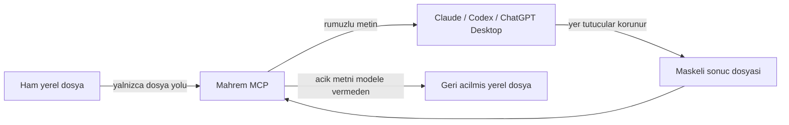

# Mahrem

**Hassas veriyi yapay zekâya gitmeden önce cihazda rumuzlayan açık kaynak gizlilik katmanı.**

Mahrem ayrı bir SaaS veya belge yükleme sitesi değildir. Claude Code, Codex ve yerel MCP destekleyen masaüstü istemcilerinin çağırdığı bir araç + skill paketidir. Kod MIT lisanslıdır, API anahtarı istemez ve Mahrem'in kendi kodunda ağ çağrısı yoktur. Claude/GPT kullanımının kendi abonelik veya API maliyeti ayrıdır.

> Önemli: Ham metni önce sohbete yapıştırıp sonra “maskele” demek güvenli değildir. Metin o anda modele ulaşmış olur. Mahrem bu nedenle metin değil, **yerel dosya yolu** kabul eder.

## Nasıl çalışır?



Ornek:

```text
Musteri: Ayse Deneme
TCKN: 10000000146
E-posta: ayse.deneme@example.com
```

sununa donusur:

```text
Musteri: [KISI-1]
TCKN: [TCKN-1]
E-posta: [EPOSTA-1]
```

Aynı değer, aynı MCP oturumu boyunca aynı rumuzu alır. Model maskeli metinle çalışır. Sonuç tamamlanınca `restore_file`, gerçek değerleri yalnızca yerel çıktı dosyasına yazar; açık metni model yanıtına döndürmez.

## V0 kapsamı

- TCKN: yalnizca checksum'u gecerli adaylar
- TR IBAN: uzunluk ve mod-97 kontrolu
- Turkiye cep telefonu
- E-posta
- Luhn uyumlu kart numarasi
- IPv4 ve URL
- `Musteri:`, `Davaci:`, `Davali:` gibi belirli etiketlerden sonra gelen kisi adlari
- Yerel `rules.json` ile ozel kisi/kurum terimleri ve allowlist
- UTF-8 `.txt` ve `.md` dosyalari

Bu bir alpha sürümüdür. Serbest metindeki tüm kişi ve kurum adlarını bulduğunu iddia etmez. PDF, DOCX, kalıcı şifreli kasa ve tamamen yerel NER modeli sonraki aşamalardır.

## Kurulum

Gerekenler: Python 3.10+ ve `uv`.

```powershell
git clone https://github.com/orhanluce/mahrem.git
cd mahrem
uv tool install .
```

`mahrem-mcp` komutunun PATH uzerinde oldugunu kontrol edin:

```powershell
mahrem --help
```

### Claude Code

Repo hem Claude plugin manifestini hem de `.mcp.json` dosyasini icerir:

```powershell
claude --plugin-dir .
```

Claude icinde `/mahrem:mahrem` komutunu kullanabilir veya “bu dosyayi Mahrem ile isle” diyebilirsiniz.

### Codex ve ChatGPT masaustu

Yerel MCP sunucusunu bir kez ekleyin:

```powershell
codex mcp add mahrem -- mahrem-mcp
codex mcp list
```

Skill'i kullanici kapsaminda kurmak icin `skills/mahrem` klasorunu `%USERPROFILE%\.agents\skills\mahrem` altina kopyalayabilirsiniz. Repo bir Codex uyumluluk manifesti de icerir: `.codex-plugin/plugin.json`.

ChatGPT web yerel Codex yapılandırmasını okumaz. Web arayüzünde gönder tuşundan önce koruma istiyorsak ikinci aşamada tarayıcı eklentisi gerekir.

## Kullanim

Dosya yollarini mutlak verin.

```powershell
mahrem scan "C:\Belgeler\dava-notu.md"
mahrem mask "C:\Belgeler\dava-notu.md"
```

CLI rumuzlu dosya olusturur fakat surec kapaninca geri acma tablosu silinir. Geri acilabilir akista Claude/Codex icindeki uzun omurlu MCP sunucusunu kullanin.

MCP araclari:

- `scan_file`: Ham degerleri gostermeden tur/adet raporu verir.
- `mask_file`: Rumuzlu dosya ve modele uygun maskeli metin olusturur.
- `restore_file`: Sonucu yerelde geri acar, acik metni modele dondurmez.
- `forget_session`: Bellek ici eslesme tablosunu siler.

Özel terimler için [örnek kural dosyasını](examples/rules.example.json) kopyalayın. Allowlist eşleşmeleri tam değer üzerinden yapılır. Gerçek isimleri bu yerel JSON'a yazın; sohbete yapıştırmayın.

## Gelistirme

```powershell
uv sync
uv run python -m unittest discover -s tests -v
uv run mahrem scan "$PWD\examples\ornek-belge.txt"
```

## Guvenlik ve sinirlar

Tehdit modeli ve bilinen sınırlar [SECURITY.md](SECURITY.md) dosyasındadır. Kısa hali:

- Ag istegi ve telemetri yok.
- Eslesmeler diske yazilmaz; MCP sureci kapaninca geri acma olanagi da kapanir.
- Geri acilmis dosya ajan tarafindan yeniden okunmamalidir.
- Otomatik tespit uzman kontrolunun yerine gecmez.

## Yol haritasi

1. Yerel Turkce NER ile kisi/kurum/adres tespiti
2. Sifreli ve kullanici parolali oturum kasasi
3. DOCX/PDF icin bicimi koruyan donusum
4. ChatGPT ve Claude web icin gonderim-oncesi tarayici eklentisi
5. Farkli diller icin tespit paketleri

Katki kurallari icin [CONTRIBUTING.md](CONTRIBUTING.md) dosyasina bakin.
